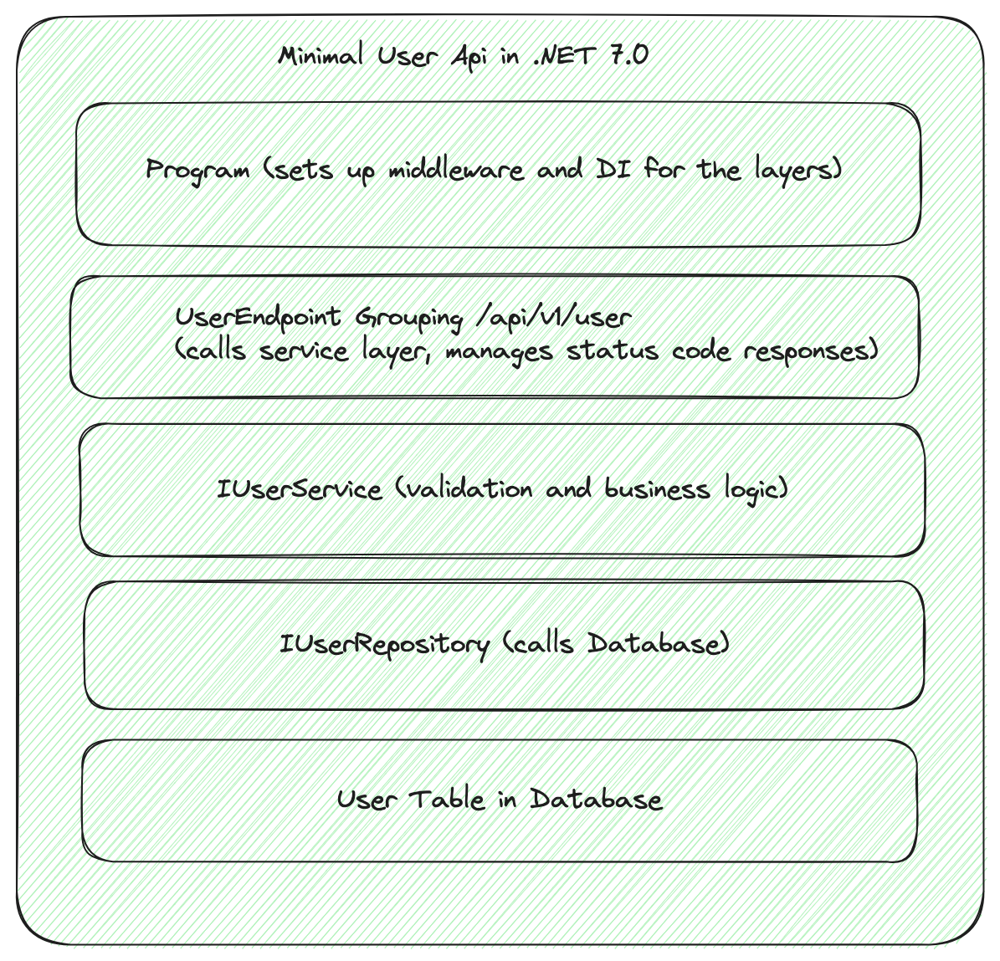
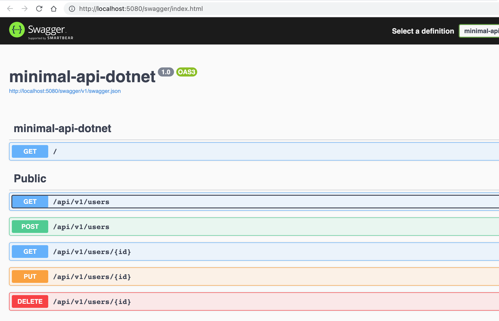

# Building a Minimal Web API in ASP.NET Core 7 with clear separation of concerns

> Building a minimal user web api with Entity Framework and SQLite on ASP.NET Web API Core 7



## Prerequisites

[Install dotnet core](https://dotnet.microsoft.com/en-us/download)

## Run from within this directory

`dotnet watch run`

## Directory structure

This structure reflects a clear separation of concerns and makes your project easy to navigate and maintain.

```
.
├── /                      # Root directory
├── Program.cs             # Main entry point for the application
├── /ef                    # Directory for Entity Framework related files
│   └── UserContext.cs       # EF Core DB Context for User
├── /endpoint              # Directory for API endpoints
│   └── UserEndpoint.cs      # API endpoint for User
├── /Migrations            # Directory for database migration scripts
├── /poco                  # Directory for Plain Old CLR Objects (POCOs) or simple entities
│   ├── User.cs              # POCO class for User
│   └── UserValidator.cs     # Class for User validation
├── /repository            # Directory for repository classes
│   ├── IUserRepository.cs  # Interface for User repository
│   └── UserRepository.cs   # Class implementing User repository
├── /services              # Directory for service classes
│   ├── IUserService.cs     # Interface for User service
│   └── UserService.cs      # Class implementing User service
└── /wwwroot               # Root directory for static files
    └── /content           # Directory for content files
        └── /data          # Directory for database files
            └── user.db    # SQLite database file for User

```

## API Explorer with Swashbuckle



## Dependencies added for this api service

Sets up the required packages to use SqlLite with .NET 7

```
 # SQL Lite
 $: dotnet add package Microsoft.Data.Sqlite

 # Entity Framework Adapter for SQL Lite
 $: dotnet add package Microsoft.EntityFrameworkCore.Sqlite

 # Entity Framework Core Design for Migrations
 $: dotnet add package Microsoft.EntityFrameworkCore.Design

 # Elegant Model Validation
 $: dotnet add package FluentValidation.AspNetCore

 # Open Api Specification for decorating Api's
 $: dotnet add package Microsoft.AspNetCore.OpenApi

 # Swashbuckle for Api Documentation
 $: dotnet add package Swashbuckle.AspNetCore
```

## Define the SQL Lite Connection String

In **appsettings.Development.json** and \***\*appsettings.json** add

```
  "ConnectionStrings": {
    "DefaultConnection": "Data Source=./wwwroot/content/data/user.db"
  },
```

Create a `wwwroot/content/data` directory to host the SQLLite File

## Ensure SqlLite Local Copy does not override the production version

In **minimal-api-dotnet.csproj** add the `ItemGroup`

```
  <ItemGroup>
    <Content Update="wwwroot\content\**\*" CopyToPublishDirectory="Never" />
  </ItemGroup>
```

**FAIR WARNING** - publish via FTP will preserve the SQL Lite DB, but it will get blown away if you
deploy via Github Actions, using the `uses: actions/upload-artifact@v2` step

## SQLLite Database with Entity Framework Core Support

See the `ef` directory for the creation of a `UserContext`, this will be the class that drives
the EntityFramework. It contains a `DbSet<User>` for a `User` table containing an `Id` and a `Name`.
We will run a migration script to add an `Email` column also.

Configuring the EntityFramework connection string in `Program.cs` makes it a sinch to get up and running,
by taking the Connection String from the Configuration we defined previously.

```
using Microsoft.EntityFrameworkCore;

var builder = WebApplication.CreateBuilder(args);
builder.Services.AddDbContext<UserContext>(options =>
  options.UseSqlite(builder.Configuration.GetConnectionString("DefaultConnection")));
var app = builder.Build();
```

## Dependency Injection of for Validation, Service and Repository classes

```
// DI the user service,  user validator and the db context
builder.Services.AddScoped<IUserService, UserService>();
builder.Services.AddScoped<IValidator<User>, UserValidator>();
builder.Services.AddScoped<IUserRepository, UserRepository>();
```

## Setting up the User API endpoints couldn't be easier

In the `endpoint` directory, create a `UserEndpoint` static class to map all the `http` methods available.
You can then call the EntityFramework directory to fetch from or update the Database table.
Endpoint groups allow you to manage API versioning. The Fluent Api enables easy chaining of features such as Cors, Authorization, and Rate Limiting

```
Program.cs

...

app.MapGroup("/api/v1/users")
    .MapGroupOneUserApi()
    .WithTags("Public")
```

## Running a Database Migration to add email to the Users table in the Users Database (already applied)

```
$: dotnet ef migrations add AddUserEmail
$: dotnet ef migrations update
```

## Running a Database Migration to make email a required field on the Users table in the Users Database (already applied)

```
$: dotnet ef migrations add UserEmailRequired
$: dotnet ef migrations update
```

## Test the Api

`$: dotnet watch run`

## View the Swashbuckle UI for Api Specification

`http://localhost:5080/swagger/index.html` - you can test the api's from here

```
# Fetch all users
curl http://localhost:5080/api/v1/users

# Fetch a single user
curl http://localhost:5080/api/v1/users/18

# Add a User
curl 'http://localhost:5080/api/v1/users' \
  -X 'POST' \
  -H 'Content-Type: application/json' \
  --data-raw '{"name":"Anew User","email":"anewuser@foo.com"}' \
  --compressed

# Update a User
curl 'http://localhost:5080/api/v1/users/18' \
  -X 'PUT' \
  -H 'Content-Type: application/json' \
  --data-raw '{"id":"18","name":"Gerry Foo","email":"gerrry@foo.com"}' \
  --compressed

# Delete a User
curl 'http://localhost:5080/api/v1/users/18' \
  -X 'DELETE' \
  -H 'Content-Type: application/json' \
  --compressed
```
